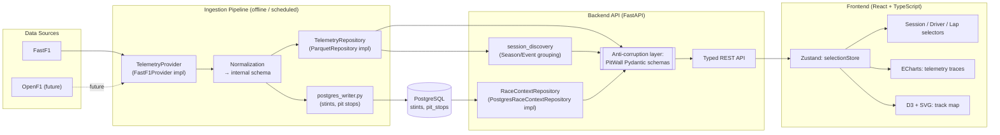

# PitWall — System Architecture

Companion to `docs/prd.md` (vision, scope, roadmap) and `docs/adr/` (why each decision below was made over its alternatives). This document described the system as frozen for V1 implementation; it has since been extended, milestone by milestone (M8–M19), rather than rewritten — each addition below is called out by milestone, and the original V1 material is left in place as the foundation those additions build on.

## 1. System Overview & Data Flow

V1 is a **modular monolith**, not microservices (ADR-0001): one backend service reads from a shared processed-data cache; ingestion runs as a separate offline/scheduled process, not a network service the backend calls at request time. This keeps deployment and operations simple at a scale — a handful of read endpoints over pre-computed data — where a service split would be pure overhead.



M10 (ADR-0011) adds PostgreSQL as a **second, independent** store alongside Parquet — not a
replacement for it — for the two genuinely relational entities Parquet can't serve well: stints and
pit stops. Everything else (sessions, drivers, laps including the new `compound` column, telemetry,
track geometry) stays on Parquet, unchanged.

M12 adds a **discovery layer**, both offline (pipeline) and at request time (backend) — no new
store, no new node type in the diagram above beyond the `session_discovery` grouping step just
added. On the pipeline side, `FastF1Provider.discover_event()`/`discover_season()` (Tier A: one
schedule-only FastF1 call, no `.load()`) resolve an `Event` — the `(season, event slug)` grouping
identity above `Session`, defined in `pitwall_pipeline/models.py` but **never written to Parquet or
Postgres** — and feed `pitwall_pipeline/ingest_plan.py`'s `build_ingestion_plan()`/
`execute_ingestion_plan()`, a `DISCOVER → PLAN → REVIEWABLE PLAN → EXECUTE` control plane for
ingesting more than one session at a time (event- and season-level), built entirely on the
already-existing, unchanged `ingest_session()`/`ingest_event()`. This is the machinery M12 Phase 7
used to backfill 2020–2026 (704 sessions as of the last real ingestion batch) — a controlled,
explicitly-approved, one-season-at-a-time operation, never an automatic bulk sweep (see
`docs/m12-implementation-plan.md`'s own non-goals). On the backend side, `Session.event_id` is an
additive, *computed* field (`app/utils/ids.py`, independent of but formula-identical to the
pipeline's own `make_event_id`) — grouped by `app/services/session_discovery/` (the `Discovery` node
above) into `GET /seasons`/`GET /seasons/{season}/events`/`GET
/seasons/{season}/events/{event_id}/sessions`, reflecting only what PitWall has actually ingested,
never FastF1's upstream schedule. No Event table exists in Postgres; both the pipeline's `Event` and
the backend's season/event grouping are computed on read, not persisted, by explicit design (design
review §7). See `docs/data-model.md`'s M12 addition and `docs/api-model.md`'s M12 addition for the
full field/route-level detail.

Why pre-process instead of calling FastF1 live on each request: FastF1 pulls from F1's live-timing archive and parses it, which is slow (seconds to tens of seconds per session) and rate-limit sensitive. An offline/batch ingestion step fetches a session once, normalizes it, and the API only ever reads from the resulting cache — the app also keeps working if the upstream source has a bad day.

M13 generalizes `/laps/compare` from two drivers within one shared session to two
**independently-selected sessions** (`session_id_a`/`session_id_b`, retiring the earlier
single-session `GET /sessions/{session_id}/laps/compare` route) — no new diagram node, the
existing `API` box already covers it; `app/services/lap_comparison/`'s own alignment/delta/sector
logic is unaffected by the session-identity generalization.

M14 adds the one genuinely new architectural element since the diagram above was drawn: a
cross-component synchronized-cursor mechanism, backed by page-scoped **Zustand cursor stores**
(`comparisonStore`'s `hoverDistance` slot and a sibling `track-map/cursorStore.ts`) — **not**
ECharts' own `connect()`/cross-instance `axisPointer.link` as ADR-0008 originally anticipated:
that mechanism can't reach the SVG track map, so it isn't usable as the cross-component sync
mechanism at all (`docs/m14-design-review.md` §8). ECharts' `axisPointer.link` option is still
used, but only *within* one chart instance's own multiple grids, not across components. Coverage
is the single-lap track-map page and the M13 cross-session lap-comparison page only — session-
analytics and tyre-performance charts are not yet part of this synchronized surface.

M15 extends M13's cross-session pattern to stint/tyre strategy: `/stints/compare` mirrors
`/laps/compare`'s independently-resolved-sides shape exactly, reusing M11's
`build_driver_stint_pace`/`driver_strategy_summary` unchanged, called once per side — no new
repository method, no new diagram node.

M17 adds a cross-season driver pace-trend endpoint, reusing M8's `summarize_driver` unchanged with
an empty `telemetry_by_lap` (every field it exposes is computed from `Lap` data alone, so
telemetry is never fetched) — again no new diagram node, and no new repository method beyond the
session-lookup index described in §3 below.

## 2. Layering Principle

Every layer depends only on the layer directly below it in the diagram above. Concretely:

- The frontend never imports, references, or assumes anything about FastF1, OpenF1, or Parquet — it only knows PitWall's typed REST API.
- The backend never returns a FastF1- or Parquet-shaped object from an endpoint; every response is transformed into a PitWall-defined Pydantic model at the anti-corruption boundary (ADR-0009).
- The pipeline's `TelemetryProvider` implementations (ADR-0005) are the only code that knows FastF1's or OpenF1's native API shape; everything downstream sees only the normalized internal schema.

This rule exists specifically so that changing a data provider or a storage engine is an implementation swap, never a change that ripples into the API contract or the UI.

## 3. Provider & Repository Abstractions

**`TelemetryProvider`** (pipeline layer, ADR-0005): an interface shaped around PitWall's normalized internal schema, not around FastF1's API. `FastF1Provider` is the sole V1 implementation. Future sources (OpenF1 for live data, file imports, simulator telemetry) become new implementations of this interface rather than changes to ingestion logic. M12 adds `discover_event()`/`discover_season()` to this same provider (Tier A: schedule-only, no `.load()`) — discovery is a capability of the existing provider, not a new interface.

**`TelemetryRepository`** (backend layer, ADR-0006): an interface defined by the API's actual read patterns (fetch a session/driver/lap's telemetry, list sessions), injected into route handlers via FastAPI's `Depends()`. `ParquetRepository` remains its sole implementation. M10 (ADR-0011) resolved the Postgres migration this ADR anticipated differently than originally predicted here: relational race-strategy data is served through a second, separate interface instead of extending this one (below) — `TelemetryRepository` itself was never touched.

**`ParquetRepository`'s in-process caching/indexing lineage (M17→M18→M19, performance only — no
interface or schema change at any stage):** three layers, each built on the previous, all lazy,
per-`ParquetRepository`-**instance**, and **request-scoped** — `app/dependencies.py`'s
`get_telemetry_repository()` constructs a fresh instance per request (no `@lru_cache`, no
singleton), and every route is a plain `def` (its own threadpool worker), so no instance, and
therefore none of these caches, is ever shared across requests or threads. None of the three
writes anything to Parquet, Postgres, or any other persistent store — every cache described here
is plain in-memory Python state that exists only for the lifetime of the `ParquetRepository`
object that holds it, and is gone once that request finishes (see `docs/data-model.md`'s M13–M19
section for the explicit no-schema-change statement this implies).
- **M17 — session discovery index** (`_index()`): memoizes the `session_id -> (session_dir,
  Session)` scan that previously re-globbed and re-read every session's `session.parquet` on every
  lookup, built once per instance on first use.
- **M18 — per-session file caches** (`_cached_read()`): reads each of a session's own
  `drivers.parquet`/`laps.parquet`/`telemetry.parquet`/`track.parquet` at most once per session,
  per instance, cached unfiltered — filtering/sorting still happens per call, on the cached frame,
  never written back into the cache.
- **M19 — telemetry driver/lap positional index** (`_telemetry_positions()`/
  `_group_telemetry_by_driver_lap()`): on top of M18's cached, unfiltered telemetry frame, a
  `(driver_id, lap_number) -> row positions` index built via one `groupby(...).indices` pass at
  most once per session, per instance — replacing a fresh full-frame boolean-mask scan on every
  `get_telemetry()` call with a positional `.iloc[...]` lookup. Stores row *positions*, not row
  *data*, so it coexists with, rather than replaces, M18's flat cache.

Together these took a real full-grid `session_analytics` request from ~37.7s (pre-M17) to the low
single digits of seconds, with a byte-identical response body at every stage — see
`docs/m17-design-review.md`, `docs/m18-design-review.md`, and `docs/m19-design-review.md` for the
full measurements and correctness arguments.

**`RaceContextRepository`** (backend layer, ADR-0011, M10): a second, independent interface for the genuinely relational data Parquet can't serve well — stints and pit stops. `PostgresRaceContextRepository` is its sole implementation, backed by PostgreSQL. Deliberately not merged into `TelemetryRepository`: the two interfaces have unrelated read patterns and back onto unrelated storage engines — see ADR-0011 for the full rationale.

Both interfaces are intentionally minimal today — they grow when a second real implementation forces them to, not in anticipation of one.

**Domain-logic services** (backend layer, `app/services/`): business logic beyond a simple repository read. `app/services/session_analytics/` (M8) computes descriptive per-driver/session statistics from `TelemetryRepository` data alone. `app/services/tyre_performance/` (M11) is the first such package to read from **both** repositories in the same request — it joins `Lap`/`TelemetrySample` (Parquet, via `TelemetryRepository`) against `Stint`/`PitStop` (PostgreSQL, via `RaceContextRepository`) entirely in application code, over already-typed Pydantic objects. This is not a database-level join and does not introduce a cross-engine foreign key — ADR-0011's "no FK from Postgres to a Parquet file" constraint is about the storage layer, and remains untouched; the two repositories are still queried independently, each ignorant of the other. It backs two endpoints: `GET /sessions/{session_id}/drivers/{driver_id}/stint-pace` (one driver's per-stint raw lap-time series) and `GET /sessions/{session_id}/tyre-performance` (session-wide compound/strategy aggregates) — descriptive statistics only, see `docs/api-model.md` for response shapes and `docs/m11-design-review.md` for why no fitted/predictive metric is in scope. `app/services/session_discovery/` (M12) is the simplest of the three: pure grouping/ordering functions over `TelemetryRepository.list_sessions()` alone (no second repository, no join) — it backs the three `/seasons` routes described above.

The concrete normalized schema `TelemetryProvider` implementations produce — `Session`, `Driver`, `Lap`, `TelemetrySample`, `TrackPoint` — is defined in `docs/data-model.md`, along with the Parquet cache layout `TelemetryRepository` will read in M2.

## 4. Technology Stack

Full rationale and rejected alternatives for each row live in the linked ADR — this table is the current-state summary, not a repeat of the argument.

| Layer | V1 choice | ADR |
|---|---|---|
| Data source | FastF1 | ADR-0005 |
| Storage (telemetry, sessions, drivers, laps, track) | Parquet | ADR-0004 |
| Storage (race-strategy: stints, pit stops) | PostgreSQL | ADR-0011 |
| Backend | FastAPI | ADR-0002 |
| Frontend | React + TypeScript | ADR-0003 |
| State management | Zustand, stores scoped by concern | ADR-0007 |
| Routing | react-router-dom | ADR-0010 |
| Telemetry charts | Apache ECharts | ADR-0008 |
| Track map | D3 + SVG/canvas (custom, not a standard chart) | — |
| Deployment | Docker Compose (local) + Vercel/Fly.io-class host (demo) | — |
| Testing | pytest (Python); Vitest + React Testing Library (frontend); Playwright (later, e2e smoke) | — |
| CI | GitHub Actions: lint, format-check, type-check, test per workspace | — |

## 5. Repository Structure

This reflects the structure as of M1, extended in place by each later milestone (M8–M19) rather
than restated from scratch; a second `TelemetryRepository` implementation still doesn't exist (see
`docs/prd.md` §3 for what remains unscheduled).

```
pitwall/
├── README.md                  # vision, status, quickstart, disclaimer
├── LICENSE
├── CLAUDE.md                  # coding standards, conventions, process
├── docs/
│   ├── prd.md
│   ├── architecture.md        # this document
│   ├── data-model.md          # pipeline domain model design note (M1)
│   ├── success-metrics.md
│   ├── adr/                   # Architecture Decision Records, one file per decision
│   └── releases/               # per-milestone release notes
├── pipeline/                  # data ingestion (Python + FastF1)
│   ├── pyproject.toml
│   ├── pitwall_pipeline/
│   │   ├── providers/           # TelemetryProvider interface + FastF1Provider
│   │   ├── normalize.py
│   │   ├── track.py             # TrackPoint derivation
│   │   ├── cache_writer.py
│   │   ├── postgres_writer.py   # stints/pit_stops upsert (M10)
│   │   ├── ingest.py            # CLI entrypoint (single session)
│   │   ├── ingest_event.py      # event-level ingestion (M12)
│   │   ├── ingest_plan.py       # multi-event/season DISCOVER→PLAN→EXECUTE (M12)
│   │   └── utils/
│   └── tests/
├── backend/                   # FastAPI service
│   ├── pyproject.toml
│   ├── app/
│   │   ├── main.py
│   │   ├── api/                 # route modules per resource, incl. seasons.py (M12),
│   │   │                        #   laps_compare.py (M6/M13), stints_compare.py (M15),
│   │   │                        #   driver_trends.py (M17)
│   │   ├── models/              # Pydantic schemas (the anti-corruption boundary), incl. discovery.py (M12)
│   │   ├── repositories/        # TelemetryRepository interface + ParquetRepository; RaceContextRepository (M10)
│   │   ├── utils/ids.py         # event_id derivation (M12)
│   │   └── services/            # domain logic (session_analytics/, tyre_performance/, session_discovery/ (M12))
│   └── tests/
├── frontend/                  # React + TypeScript app
│   ├── package.json
│   ├── src/
│   │   ├── api/                  # typed API client
│   │   ├── state/                # Zustand stores (selectionStore; cursorStore, shipped M14)
│   │   └── features/             # session-select (Season/Event/Session pages, M12), track-map, telemetry-charts, delta-graph (from M3)
│   └── tests/
├── data/                       # gitignored — local processed cache
├── docker-compose.yml
└── .github/
    └── workflows/
        └── ci.yml               # single workflow, path-filtered per workspace (backend/pipeline/frontend)
```

## 6. Open implementation detail (flagged, not yet decided)

The processed-data cache's physical location for V1 is stated as "Parquet files on disk (or object storage)" but not pinned down further. For local dev this is unambiguous (a mounted volume); for the public demo deployment it needs a concrete choice (a persistent disk on the container host vs. object storage like S3/R2). This isn't an architectural fork worth an ADR — it's a deployment configuration detail — but it should be settled explicitly during M0/M7 rather than left implicit.
