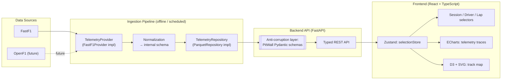

# PitWall — System Architecture

Companion to `docs/prd.md` (vision, scope, roadmap) and `docs/adr/` (why each decision below was made over its alternatives). This document describes the system as currently frozen for V1 implementation.

## 1. System Overview & Data Flow

V1 is a **modular monolith**, not microservices (ADR-0001): one backend service reads from a shared processed-data cache; ingestion runs as a separate offline/scheduled process, not a network service the backend calls at request time. This keeps deployment and operations simple at a scale — a handful of read endpoints over pre-computed data — where a service split would be pure overhead.



Why pre-process instead of calling FastF1 live on each request: FastF1 pulls from F1's live-timing archive and parses it, which is slow (seconds to tens of seconds per session) and rate-limit sensitive. An offline/batch ingestion step fetches a session once, normalizes it, and the API only ever reads from the resulting cache — the app also keeps working if the upstream source has a bad day.

## 2. Layering Principle

Every layer depends only on the layer directly below it in the diagram above. Concretely:

- The frontend never imports, references, or assumes anything about FastF1, OpenF1, or Parquet — it only knows PitWall's typed REST API.
- The backend never returns a FastF1- or Parquet-shaped object from an endpoint; every response is transformed into a PitWall-defined Pydantic model at the anti-corruption boundary (ADR-0009).
- The pipeline's `TelemetryProvider` implementations (ADR-0005) are the only code that knows FastF1's or OpenF1's native API shape; everything downstream sees only the normalized internal schema.

This rule exists specifically so that changing a data provider or a storage engine is an implementation swap, never a change that ripples into the API contract or the UI.

## 3. Provider & Repository Abstractions

**`TelemetryProvider`** (pipeline layer, ADR-0005): an interface shaped around PitWall's normalized internal schema, not around FastF1's API. `FastF1Provider` is the sole V1 implementation. Future sources (OpenF1 for live data, file imports, simulator telemetry) become new implementations of this interface rather than changes to ingestion logic.

**`TelemetryRepository`** (backend layer, ADR-0006): an interface defined by the API's actual read patterns (fetch a session/driver/lap's telemetry, list sessions), injected into route handlers via FastAPI's `Depends()`. `ParquetRepository` is the sole V1 implementation; Postgres becomes a second implementation in V3 when relational queries (stints joined against pit stops, etc.) are actually needed.

Both interfaces are intentionally minimal today — they grow when a second real implementation forces them to, not in anticipation of one.

## 4. Technology Stack

Full rationale and rejected alternatives for each row live in the linked ADR — this table is the current-state summary, not a repeat of the argument.

| Layer | V1 choice | ADR |
|---|---|---|
| Data source | FastF1 | ADR-0005 |
| Storage | Parquet (→ Postgres in V3) | ADR-0004 |
| Backend | FastAPI | ADR-0002 |
| Frontend | React + TypeScript | ADR-0003 |
| State management | Zustand, stores scoped by concern | ADR-0007 |
| Telemetry charts | Apache ECharts | ADR-0008 |
| Track map | D3 + SVG/canvas (custom, not a standard chart) | — |
| Deployment | Docker Compose (local) + Vercel/Fly.io-class host (demo) | — |
| Testing | pytest (Python); Vitest + React Testing Library (frontend); Playwright (later, e2e smoke) | — |
| CI | GitHub Actions: lint, format-check, type-check, test per workspace | — |

## 5. Repository Structure

```
pitwall/
├── README.md                  # vision, screenshots, disclaimer, quickstart
├── LICENSE
├── CONTRIBUTING.md
├── docs/
│   ├── prd.md
│   ├── architecture.md        # this document
│   ├── success-metrics.md
│   └── adr/                   # Architecture Decision Records, one file per decision
├── pipeline/                  # data ingestion (Python + FastF1)
│   ├── pyproject.toml
│   ├── pitwall_pipeline/
│   │   ├── providers/          # TelemetryProvider interface + FastF1Provider
│   │   ├── normalize.py
│   │   └── cache_writer.py
│   └── tests/
├── backend/                   # FastAPI service
│   ├── pyproject.toml
│   ├── app/
│   │   ├── main.py
│   │   ├── api/                 # route modules per resource
│   │   ├── models/              # Pydantic schemas (the anti-corruption boundary)
│   │   ├── repositories/        # TelemetryRepository interface + ParquetRepository
│   │   └── services/
│   └── tests/
├── frontend/                  # React + TypeScript app
│   ├── package.json
│   ├── src/
│   │   ├── components/
│   │   ├── features/            # session-select, track-map, telemetry-charts, delta-graph
│   │   ├── api/                  # typed API client
│   │   └── state/                # Zustand stores (selectionStore, later cursorStore)
│   └── tests/
├── data/                       # gitignored — local processed cache
├── docker-compose.yml
└── .github/
    └── workflows/
        ├── backend-ci.yml
        ├── frontend-ci.yml
        └── pipeline-ci.yml
```

## 6. Open implementation detail (flagged, not yet decided)

The processed-data cache's physical location for V1 is stated as "Parquet files on disk (or object storage)" but not pinned down further. For local dev this is unambiguous (a mounted volume); for the public demo deployment it needs a concrete choice (a persistent disk on the container host vs. object storage like S3/R2). This isn't an architectural fork worth an ADR — it's a deployment configuration detail — but it should be settled explicitly during M0/M7 rather than left implicit.
